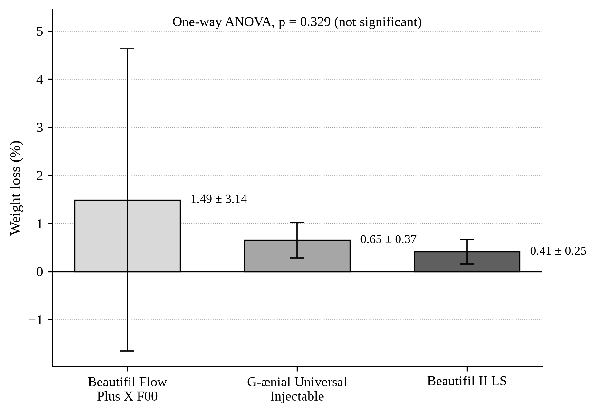
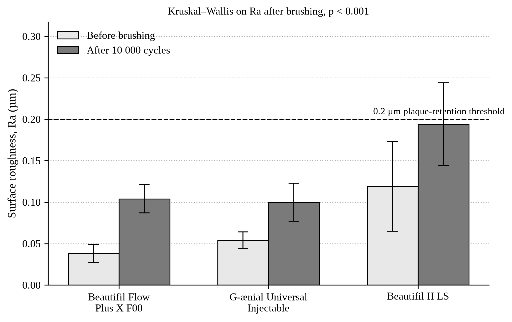
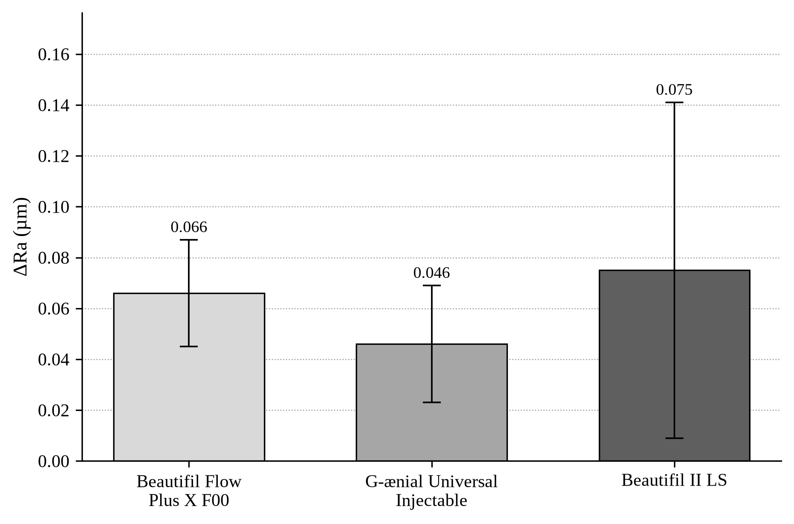

# COMPARATIVE EVALUATION OF WEAR RESISTANCE AND SURFACE ROUGHNESS OF INJECTABLE VERSUS CONVENTIONAL NANOHYBRID COMPOSITE RESINS

**(In Vitro Study)**

A thesis submitted in partial fulfilment of the requirements for the degree of Master of Science in Conservative Dentistry

Submitted by

Mohamed Talaat Mohamed AbdelMoaty ElAbd

Faculty of Dentistry  
Department of Conservative Dentistry  
Pharos University in Alexandria  

2025 / 2026

---

## Supervisors

**Supervision Committee** (as named on the approved research protocol)

1. Prof. Wegdan M. Abdel-Fattah
2. Asst. Prof. Emad M. El-Sayed (Main supervisor)

---

## Acknowledgements

I wish to thank my supervisors for their guidance throughout the planning and writing of this work, and the laboratory staff who supported the experimental procedures. I am grateful to my family for their patience during the period of study.

---

## Abstract

**Background.** Highly filled injectable composites are marketed for use in load-bearing restorations. Independent data comparing their gravimetric wear and surface roughness after standardised toothbrush abrasion with those of a conventional nanohybrid resin remain limited.

**Aim.** To compare percentage weight loss and arithmetic mean roughness (Ra) of Beautifil Flow Plus X F00, G-ænial Universal Injectable and Beautifil II LS after 10 000 toothbrushing cycles.

**Methods.** Thirty-six discs (10 mm diameter × 1 mm thick; n = 12 per group) were subjected to 10 000 brushing cycles at a load of 2 N in a Colgate Total slurry prepared according to ISO guidance. Specimen mass was recorded before and after abrasion. Ra was measured by contact profilometry. Percentage weight loss was compared by one-way ANOVA. Ra after brushing was compared by the Kruskal–Wallis test (α = 0.05).

**Results.** Mean percentage weight loss was 1.49 ± 3.14 % for Beautifil Flow Plus X F00, 0.65 ± 0.37 % for G-ænial Universal Injectable and 0.41 ± 0.25 % for Beautifil II LS (p = 0.329). Mean Ra after brushing was 0.104 ± 0.017 µm, 0.100 ± 0.023 µm and 0.194 ± 0.050 µm respectively (p < 0.001). Each injectable resin was significantly smoother than Beautifil II LS. The two injectable materials did not differ from each other. One Beautifil Flow Plus X F00 disc lost approximately 11.4 % of its mass and accounts for the large standard deviation in that group.

**Conclusions.** Under this toothbrushing protocol, gravimetric wear did not differ significantly among the three resins. Both injectable materials remained significantly smoother than the conventional nanohybrid. Mean Ra of the injectable resins stayed below the 0.2 µm plaque-retention threshold, whereas the nanohybrid mean lay on that threshold.

**Keywords.** Injectable composite; nanohybrid composite; toothbrush abrasion; wear; surface roughness; giomer.

---

## List of tables

- Table 3.1 Composition of the resin composites
- Table 4.1 Weight before and after brushing and percentage weight loss
- Table 4.2 Absolute weight loss after 10 000 brushing cycles
- Table 4.3 Ra before and after brushing and ΔRa

---

## List of figures

- Figure 4.1 Mean percentage weight loss after 10 000 brushing cycles
- Figure 4.2 Mean Ra before and after brushing, with the 0.2 µm plaque-retention threshold
- Figure 4.3 Mean change in surface roughness (ΔRa)

---

## List of abbreviations

ANOVA — analysis of variance  
ISO — International Organization for Standardization  
Ra — arithmetic mean roughness  
RDA — relative dentine abrasivity  
SD — standard deviation  
S-PRG — surface pre-reacted glass-ionomer  
ΔRa — change in Ra (after − before)

---

# Chapter 1
# Introduction

Resin-based composites have become the principal material for direct restoration of both anterior and posterior teeth. Their clinical performance is determined not only by handling and aesthetics but by the behaviour of the finished surface under the conditions of the mouth. Two surface properties are of particular concern. Progressive wear flattens occlusal anatomy, may reduce vertical dimension and can disturb the occlusal scheme. Increased roughness, independently of the volume of material lost, retains plaque, takes stain and favours secondary caries at the restoration margin (1,2). Daily toothbrushing contributes to both processes. The abrasive particles of a dentifrice act as a third body between the bristle and the restoration: the resin-rich surface layer is removed first, filler particles are then left standing proud or are plucked from the matrix, mass is lost and the arithmetic mean roughness (Ra) rises (3,4).

For many years the materials used in load-bearing cavities were high-viscosity pastes, while low-filled flowable resins were reserved for liners, small defects and situations in which adaptation was more important than strength. First-generation flowables typically contained 40–55 wt% filler and showed higher polymerisation shrinkage and poorer wear resistance than their packable counterparts (5). A later generation of highly filled injectable composites was formulated to close that gap. By combining a higher inorganic load, a smaller mean particle size and improved silane treatment, manufacturers produced pastes that can still be injected from a syringe yet are offered for use in Class I and II restorations (6). Two such products, G-ænial Universal Injectable (GC Corporation, Tokyo, Japan) and Beautifil Flow Plus X F00 (Shofu Inc., Kyoto, Japan), are now in routine clinical use. Beautifil II LS (Shofu Inc.), a sculptable low-shrinkage nanohybrid giomer, remains a representative conventional paste and was chosen as the control material for the present work.

The laboratory literature on these products is uneven. Two-body chewing-simulator studies, in which a steatite antagonist is loaded at about 49 N, have reported favourable volumetric wear and flexural strength for highly filled injectables (6). Those data describe occlusal-contact wear. They do not describe the three-body abrasion produced by a toothbrush and a dentifrice slurry, which is the wear mode that acts on free cleanable surfaces and on margins throughout the life of a restoration. Toothbrushing tests conducted according to ISO/TR 14569-1, at a load of 2 N and for 10 000 strokes, are conventionally treated as the laboratory equivalent of one year of twice-daily brushing (3,7,8). Direct comparison of Beautifil Flow Plus X F00, G-ænial Universal Injectable and Beautifil II LS under that protocol has not been published.

The clinical meaning of the roughness values obtained after such a test is judged against two well-established thresholds. Bollen, Lambrechts and Quirynen concluded that plaque retention increases once Ra exceeds approximately 0.2 µm and that further smoothing below this value produces no additional clinical benefit (1). Jones, Billington and Pearson later showed that volunteers can detect roughness with the tip of the tongue once Ra lies between 0.25 µm and 0.50 µm, and they advised finishing restorations to no more than 0.50 µm (2). These two figures provide the frame within which the roughness results of the present study are interpreted.

A controlled in-vitro comparison of gravimetric wear and Ra after standardised toothbrushing is therefore required if the clinical claims made for highly filled injectable resins are to be examined against a conventional nanohybrid paste under identical abrasive conditions.

### 1.1 Aim of the study

To compare wear resistance, expressed as percentage weight loss, and surface roughness (Ra) of two highly filled injectable composites with a conventional nanohybrid composite after standardised toothbrushing.

### 1.2 Objectives

1. To measure specimen mass before and after 10 000 brushing cycles and to calculate percentage and absolute weight loss.
2. To measure Ra before and after the same abrasion and to calculate ΔRa.
3. To compare the three materials using the statistical tests appropriate to each outcome.

### 1.3 Null hypotheses

1. There is no significant difference in percentage weight loss among Beautifil Flow Plus X F00, G-ænial Universal Injectable and Beautifil II LS.
2. There is no significant difference in Ra after toothbrushing among the same three materials.

---

# Chapter 2
# Review of literature

### 2.1 Wear of restorative resins

Wear is the progressive loss of substance from two surfaces that are in relative motion (9). In the mouth the process is rarely of a single type. Attrition occurs at sites of direct occlusal contact and is essentially two-body wear. Abrasion at non-contact sites is usually three-body wear, with food particles or dentifrice abrasive as the loose third body. Corrosion, produced by chemical softening of the resin, and fatigue, produced by cyclic loading, run in parallel with both mechanical modes (9,10). Laboratory tests isolate one or two of these mechanisms in order to rank materials. They do not reproduce the multifactorial environment of the mouth and therefore cannot be read as a clinical lifetime (10).

The wear resistance of a resin composite is governed by the filler, the matrix and the interface between them. Filler volume fraction, particle size and shape, inter-particle spacing, the degree of conversion of the resin and the quality of the silane coupling layer all contribute (11,12). Condon and Ferracane examined these variables systematically in an oral-wear simulator. Wear increased once filler volume fell below 48 vol% and rose in a linear fashion as the proportion of silane-treated filler was reduced. Raising the degree of conversion reduced wear, although the effect was smaller than that of filler volume or silanation (12). Turssi, Ferracane and Vogel later showed, in a set of experimental composites, that reducing filler size improved three-body abrasion resistance for both spherical and irregular particles, provided that conversion was not compromised (24). The practical consequence of this work is that a well-coupled bed of small particles protects the resin from the abrasive and limits the size of the pits left when a particle is lost.

Classical flowable resins, filled at approximately 40–55 wt%, wear more rapidly than packable hybrids for precisely these reasons (5,13). The more recent injectable products raise filler load and reduce particle size in an attempt to retain syringeable handling without accepting that penalty. G-ænial Universal Injectable is listed at 50 vol%, a volume fraction that sits just above the 48 vol% step identified by Condon and Ferracane (6,12). Beautifil II LS is listed at 68 vol% (19).

Laboratory evaluation of toothbrush wear follows ISO/TR 14569-1 (3). The stated scope of that technical report is the wear of artificial teeth and veneering materials, but the recommended brush load (0.5–2.5 N) and the requirement that the dentifrice comply with ISO 11609 have been adopted widely for the screening of restorative composites (3,14). Sexson and Phillips estimated that a patient who makes about fifteen strokes per surface, twice daily, produces of the order of 10 000 strokes in a year (7). Most subsequent toothbrushing papers have used that figure, or a simple multiple of it, as the laboratory equivalent of one year of hygiene (8). The conversion is an estimate; brushing habits vary, and the laboratory brush does not reproduce the anatomy of a restoration. It remains, nevertheless, the convention against which the present cycle count is set.

Wear may be quantified as lost volume, as profilometric depth or as lost mass (10,15). Gravimetric loss is simple and repeatable when the balance reads to 0.1 mg and the specimen is dried in a consistent way. It does not describe the topography of the worn surface. Volumetric loss from a three-dimensional scan does, but requires equipment that was not used in this study. Heintze and colleagues compared three laboratory methods of wear quantification and showed that they do not always rank materials in the same order (15). The choice of a gravimetric outcome in the present work is therefore a methodological decision, not a claim that mass is equivalent to worn anatomy.

### 2.2 Surface roughness

The arithmetic mean roughness, Ra, is defined in ISO 4287 as the arithmetic mean of the absolute ordinate values of the roughness profile within the sampling length (16). It is insensitive to the shape of individual peaks and valleys, but it is the parameter reported in almost every dental investigation of restoration surfaces and is therefore the value against which clinical thresholds have been set. Contact stylus profilometry remains a standard laboratory method. Optical techniques generate a three-dimensional map and avoid stylus damage, but they are not required in order to rank materials on Ra (4,16).

The clinical importance of Ra was established in two independent lines of work. Quirynen and Bollen showed that surface roughness and surface-free energy together determine the amount of plaque that accumulates on restorations (17). Bollen, Lambrechts and Quirynen then reviewed the available evidence and proposed 0.2 µm as the threshold above which bacterial adhesion increases to a clinically relevant degree; surfaces smoother than this showed no further reduction in plaque (1). Jones, Billington and Pearson asked volunteers to rank composite discs of known roughness with the tip of the tongue. Discrimination lay between 0.25 µm and 0.50 µm, and the authors recommended that restorations be finished to no more than 0.50 µm if they are not to be felt (2).

Toothbrushing raises Ra. Heintze, Forjanic, Ohmiti and Rousson subjected nine composites and two ceramics to simulated brushing at three loads and showed that the increase in roughness and the loss of gloss depended on the material, the load and the duration of brushing. Hybrid and microhybrid pastes deteriorated more with increasing load than did microfilled resins (4). Nanofilled materials, whose particles are small enough to wear with the matrix, generally retain a smoother surface than nanohybrids, in which larger fillers are uncovered or lost (8,18).

The dentifrice is an independent variable. da Costa, Adams-Belusko, Riley and Ferracane brushed four composites with Colgate Total (relative dentine abrasivity 70) and with two more abrasive Colgate pastes (RDA 145 and 200). All pastes reduced gloss and increased Ra; the least abrasive paste produced the smallest change, and composites with smaller fillers were less affected than those with larger fillers (25). Monteiro and Spohr, using a different set of dentifrices, also recorded an increase in Ra after simulated brushing but found that the manufacturer’s RDA value did not predict the roughness result in a simple way (8). A single dentifrice was therefore used in the present study, and the results apply to that paste.

### 2.3 Injectable composite resins

The first generation of flowable composites was introduced to improve adaptation in narrow cavities and to serve as liners. Their filler content was deliberately kept low in order to reduce viscosity, and their mechanical properties were correspondingly inferior to those of contemporaneous hybrid pastes (5,13). Baroudi and Rodrigues, in a systematic review, concluded that conventional flowables should not be used as sole restoratives in load-bearing situations (13).

Highly filled injectable resins are a later development. G-ænial Universal Injectable contains barium glass and silica at a filler load of 50 vol% in a dimethacrylate matrix (6,18,19). Beautifil Flow Plus X F00 is a zero-flow giomer injectable that incorporates nano-sized surface pre-reacted glass-ionomer (S-PRG) filler (19). It should not be confused with Beautifil Flow Plus F00, an earlier product that appears in several laboratory papers (6). The distinction matters when results are compared.

Rajabi, Denny, Karagiannopoulos and Petridis compared G-ænial Universal Injectable and Beautifil Flow Plus F00 with a conventional flowable (Tetric EvoFlow) and a nanohybrid paste (IPS Empress Direct) in two-body wear. Specimens were cycled 200 000 times against a steatite antagonist at 49 N under dry conditions, a regimen intended to represent approximately one year of occlusal contact. Both injectables lost less volume and showed higher flexural strength than the paste and the classical flowable; the two injectables did not differ from each other (6). The finding is favourable to highly filled injectables, but the wear mode is two-body contact without toothpaste. It cannot be transferred to a toothbrushing assay.

Hasan, Eltoukhy and Zaghloul examined surface roughness after simulated toothbrushing of G-ænial Universal Injectable, a nanofilled paste (Filtek Z350 XT) and a nanohybrid (Tetric N-Ceram). Brushing times of 30 and 60 minutes were taken to represent six months and one year of daily hygiene. Ra increased in all groups. The injectable recorded the lowest mean roughness and the nanohybrid the highest; the two nanofilled resins did not differ significantly (18). That design is closer to the present study, although the nanohybrid control and the injectable giomer were not the products tested here.

Tzimas, Pappa, Fostiropoulou, Papazoglou and Rahiotis reviewed highly filled flowable resins used as sole restoratives. They concluded that optical properties are generally adequate, that mechanical properties remain inferior to those of medium-viscosity composites, and that laboratory drawbacks may contraindicate use in extensive cavities, load-bearing areas and patients with parafunction, despite a small number of randomised trials that reported acceptable early performance in Class I and II restorations (20). Material-to-material scatter is the rule, and a toothbrushing comparison of Beautifil Flow Plus X F00 with Beautifil II LS was not among the studies they included.

### 2.4 Conventional nanohybrid resins and giomers

Nanohybrid composites combine nano-sized particles with larger submicron or micron fillers. The dual size distribution is intended to increase packing density, improve polishability and raise filler load, which commonly exceeds 70–80 wt% (11). Beautifil II LS belongs to this class. Its filler load is 68 vol%. The resin contains Bis-GMA, UDMA, Bis-EMA, PEGMA and TEGDMA, and the filler includes multifunctional glass and S-PRG particles (19).

S-PRG filler is a three-layered particle: a fluoro-boro-aluminosilicate glass core, a pre-reacted glass-ionomer hydrogel phase and an outer silica coating. It releases fluoride, strontium, borate, sodium, silicate and aluminium ions and can be recharged with fluoride (23). These ion-exchange properties are the basis of the giomer concept and are clinically attractive. They are not, however, a guarantee of surface stability. Yap and colleagues showed that chemical challenge can roughen composite surfaces by softening the matrix and exposing filler (21), and the same ion-exchange behaviour that buffers acid may leave a more irregular topography once the resin-rich layer has been brushed away. Larger and irregular fillers, once uncovered, produce a higher Ra than a uniform nanofilled injectable (18).

Clinical evidence for giomer pastes is longer than the laboratory record for Beautifil II LS. Gordan, Mondragon, Watson, Garvan and Mjör followed an earlier Beautifil restoration placed with a self-etch primer for eight years and reported acceptable retention with little secondary caries in the teeth available for recall (22). That series establishes that S-PRG pastes have been used as definitive restoratives for many years. It does not describe the toothbrush roughness of Beautifil II LS.

Packable nanohybrids remain the clinical reference for posterior direct work because of their handling familiarity and their documented wear record (11). Their viscosity makes them more difficult to adapt in a narrow box and more likely to incorporate voids. Injectable products were introduced to close that handling gap. Whether they do so without a penalty in toothbrush wear or surface roughness is the question that the present experiment was designed to answer.

### 2.5 Statement of the problem

Two-body wear of G-ænial Universal Injectable and Beautifil Flow Plus F00 is favourable in one recent laboratory study (6). Toothbrush roughness of G-ænial Universal Injectable is favourable against a different nanohybrid in another (18). Beautifil Flow Plus X F00 and Beautifil II LS have not been placed beside G-ænial Universal Injectable in a single protocol that records both gravimetric loss and Ra after 10 000 cycles at 2 N. That comparison is the subject of this thesis.

---

# Chapter 3
# Materials and methods

### 3.1 Study design and sample

The investigation was a comparative in-vitro study of three commercially available resin composites. Thirty-six disc-shaped specimens, 10 mm in diameter and 1 mm thick, were prepared in a CAD/CAM Teflon mould. The discs were allocated at random to three equal groups (n = 12) according to the restorative material. An initial sample-size calculation in G*Power had indicated ten specimens per group; twelve were prepared in order to increase the power of the subsequent comparisons.

### 3.2 Materials

The materials used were:

1. G-ænial Universal Injectable — highly filled nanofilled injectable composite (GC Corporation, Tokyo, Japan).
2. Beautifil Flow Plus X F00 — highly filled injectable giomer of zero-flow consistency (Shofu Inc., Kyoto, Japan).
3. Beautifil II LS — conventional low-shrinkage nanohybrid giomer (Shofu Inc., Kyoto, Japan).
4. Colgate Total toothpaste.
5. Distilled water.

The composition of the three resins, as stated by the manufacturers, is summarised in Table 3.1.

**Table 3.1** Brand, manufacturer, matrix, filler and load of the resin composites

| Composite | Type | Matrix | Filler | Load | Manufacturer |
|-----------|------|--------|--------|------|--------------|
| G-ænial Universal Injectable (A2) | Nanohybrid injectable | Dimethacrylate monomers | Barium glass, silica | 50 vol% | GC, Tokyo |
| Beautifil Flow Plus X F00 (A2) | Nanohybrid injectable giomer | Bis-GMA, TEGDMA | Multifunctional glass and S-PRG filler | 47 vol% | Shofu, Kyoto |
| Beautifil II LS (A2) | Nanohybrid conventional giomer | Bis-GMA, UDMA, Bis-EMA, PEGMA, TEGDMA | Multifunctional glass and S-PRG filler | 68 vol% | Shofu, Kyoto |

Colgate Total was selected as the dentifrice because it is a widely used daily paste of moderate abrasivity and because it has been employed as the low-RDA reference paste in previous toothbrushing studies of resin composites (25).

### 3.3 Specimen preparation

Each material was placed in the Teflon mould as a single increment. A Mylar strip and a transparent glass slide were applied to exclude air from the test face and to produce a flat surface of uniform thickness. Polymerisation was carried out with an LED curing unit (MiniS, Woodpecker, Guilin, China) for 20 seconds at 800 mW/cm², with the tip in contact with the glass slide, followed by three additional 20-second exposures from different directions to ensure complete polymerisation. Flash was removed with a no. 12 scalpel blade. The discs were identified by group and stored in distilled water at 37 °C for 24 hours before the baseline measurements were made.

### 3.4 Baseline measurements

Each disc was dried and weighed on an electronic analytical balance (RADWAG Wagi Elektroniczne AS 220-R2), which records to 0.0001 g. Surface roughness was measured on the test face with a contact profilometer (MarSurf PS10, Mahr). Five traces were taken at random sites on each disc; the value entered for analysis was the mean of those traces. Ra was determined according to the definition in ISO 4287 (16).

### 3.5 Toothbrushing protocol

The discs were mounted in a custom toothbrushing simulator (Dental Biomaterials Department, Faculty of Dentistry, Alexandria University). A slurry of Colgate Total (relative dentine abrasivity 70) and distilled water was prepared at 250 g of toothpaste per litre of water, in accordance with ISO 11609 and ISO/TR 14569-1 (3,14). The brush load was set at 2 N, which lies within the ISO range of 0.5–2.5 N (3). Each disc received 10 000 cycles. That count is the conventional laboratory equivalent of one year of twice-daily brushing, following the estimate of Sexson and Phillips (7,8). The slurry was replaced every 5 000 cycles. At the end of the run the discs were rinsed with a stream of water and dried.

### 3.6 Post-test measurements and calculations

Mass and Ra were recorded again with the same instruments and the same drying procedure as at baseline.

Percentage weight loss was calculated for each disc as

[(W₁ − W₂) / W₁] × 100

where W₁ and W₂ are the masses before and after brushing. The group value reported in Table 4.1 is the mean of these per-disc ratios, not the ratio of the group-mean masses. The distinction is material in a group that contains an outlier.

Absolute loss in milligrams was calculated as (W₁ − W₂) × 1000.

The change in roughness was calculated for each disc as

ΔRa (µm) = Ra after − Ra before.

### 3.7 Statistical analysis

Descriptive statistics are presented as mean ± standard deviation. Percentage weight loss was compared among the three groups by one-way analysis of variance. Ra after brushing was compared by the Kruskal–Wallis test, with pairwise post-hoc comparisons between groups. The choice of a parametric test for weight loss and a non-parametric test for roughness follows the distributions of the two outcomes in the experimental spreadsheet. The level of significance was set at α = 0.05.

---

# Chapter 4
# Results

Thirty-six discs were tested, twelve in each group. All discs completed 10 000 cycles at 2 N. Wear is reported as mass; roughness is reported as Ra.

### 4.1 Weight loss

Mean mass before and after brushing, and percentage loss, are given in Table 4.1 and illustrated in Figure 4.1.

**Table 4.1** Mean weight before and after simulated toothbrushing and percentage weight loss of the tested composite resins (n = 12)

| Composite resin | Weight before (g) Mean ± SD | Weight after (g) Mean ± SD | Weight loss (%) Mean ± SD | p-value |
|-----------------|-----------------------------|----------------------------|---------------------------|---------|
| Beautifil Flow Plus X F00 | 0.1602 ± 0.0074 | 0.1576 ± 0.0031 | 1.49 ± 3.14 | |
| G-ænial Universal Injectable | 0.1630 ± 0.0102 | 0.1619 ± 0.0106 | 0.65 ± 0.37 | 0.329† |
| Beautifil II LS | 0.2313 ± 0.0154 | 0.2303 ± 0.0156 | 0.41 ± 0.25 | |

† One-way ANOVA. Values are mean ± standard deviation.

**Figure 4.1** Mean percentage weight loss of the three composite resins after 10 000 toothbrushing cycles at 2 N. Error bars represent one standard deviation (n = 12 per group). In the Beautifil Flow Plus X F00 group the standard deviation exceeds the mean, so the lower error bar extends below zero; this reflects the dispersion introduced by a single specimen that lost approximately 11.4 % of its mass and does not imply a gain in weight. Differences among groups were not statistically significant (one-way ANOVA, p = 0.329).

Beautifil II LS discs were heavier at baseline (0.2313 ± 0.0154 g) than the two injectables (0.1602 ± 0.0074 g and 0.1630 ± 0.0102 g). This follows from filler load and density, not from a difference in disc size.

One-way ANOVA on percentage loss gave p = 0.329. The first null hypothesis is therefore retained. Numerically, Beautifil II LS lost the least mass (0.41 ± 0.25 %), followed by G-ænial Universal Injectable (0.65 ± 0.37 %) and Beautifil Flow Plus X F00 (1.49 ± 3.14 %). The standard deviation in the last group is an order of magnitude larger than in the other two.

Absolute loss is set out in Table 4.2 because percentage loss on a lighter disc can exaggerate a small mass change, and because the outlying specimen is easier to see in milligrams.

**Table 4.2** Absolute weight loss after 10 000 brushing cycles (n = 12)

| Composite resin | Absolute weight loss (mg) Mean ± SD | Range (mg) |
|-----------------|-------------------------------------|------------|
| Beautifil Flow Plus X F00 | 2.58 ± 5.91 | 0.2 – 20.7 |
| G-ænial Universal Injectable | 1.07 ± 0.62 | 0.2 – 1.9 |
| Beautifil II LS | 0.95 ± 0.58 | 0.1 – 1.8 |

Values are mean ± standard deviation. The large standard deviation in Beautifil Flow Plus X F00 is attributable to one disc that lost approximately 11.4 % of its mass (20.7 mg). The remaining discs in that group, and all discs in the other two groups, lost between 0.1 mg and 1.9 mg.

The standard deviation of Beautifil Flow Plus X F00 mass fell from 7.4 mg before brushing to 3.1 mg after brushing. This is consistent with the heaviest disc in that group shedding 20.7 mg and landing near the group mean.

### 4.2 Surface roughness

Mean Ra before and after brushing, and ΔRa, are given in Table 4.3 and illustrated in Figures 4.2 and 4.3.

**Table 4.3** Mean surface roughness (Ra) before and after simulated toothbrushing and the change in roughness (ΔRa) of the tested composite resins (n = 12)

| Composite resin | Ra before (µm) Mean ± SD | Ra after (µm) Mean ± SD | ΔRa (µm) Mean ± SD | p-value |
|-----------------|--------------------------|-------------------------|--------------------|---------|
| Beautifil Flow Plus X F00 | 0.038 ± 0.011 | 0.104 ± 0.017 | 0.066 ± 0.021 | |
| G-ænial Universal Injectable | 0.054 ± 0.010 | 0.100 ± 0.023 | 0.046 ± 0.023 | < 0.001‡ |
| Beautifil II LS | 0.119 ± 0.054 | 0.194 ± 0.050 | 0.075 ± 0.066 | |

‡ Kruskal–Wallis test. Pairwise comparisons: each injectable versus Beautifil II LS, p < 0.001; the two injectables, not significant. Values are mean ± standard deviation.

**Figure 4.2** Mean surface roughness (Ra) of the three composite resins before and after 10 000 toothbrushing cycles at 2 N. Error bars represent one standard deviation (n = 12 per group). The broken line marks the 0.2 µm threshold above which plaque retention increases. Ra after brushing differed significantly among groups (Kruskal–Wallis, p < 0.001).

At baseline Beautifil II LS was already the roughest (0.119 ± 0.054 µm). Beautifil Flow Plus X F00 was the smoothest (0.038 ± 0.011 µm). G-ænial Universal Injectable lay between them (0.054 ± 0.010 µm).

Every group became rougher. Mean ΔRa was 0.066 ± 0.021 µm for Beautifil Flow Plus X F00, 0.046 ± 0.023 µm for G-ænial Universal Injectable and 0.075 ± 0.066 µm for Beautifil II LS (Figure 4.3). After 10 000 cycles the means were 0.104 ± 0.017 µm, 0.100 ± 0.023 µm and 0.194 ± 0.050 µm respectively.

**Figure 4.3** Mean change in surface roughness (ΔRa = Ra after − Ra before) of the three composite resins after 10 000 toothbrushing cycles at 2 N. Error bars represent one standard deviation (n = 12 per group).

The Kruskal–Wallis test on Ra after brushing was significant (p < 0.001). The second null hypothesis is therefore rejected. Pairwise comparisons separated Beautifil II LS from each injectable resin but did not separate the two injectables from each other.

Relative to the 0.2 µm plaque-retention threshold (1), both injectable means remained below it. The Beautifil II LS mean was 0.194 µm, on the threshold. Its standard deviation of 0.050 µm indicates that some discs in that group crossed 0.2 µm, which is visible as the upper error bar in Figure 4.2. All three means remained well below the 0.50 µm tongue-detection threshold (2).

### 4.3 Summary of the findings

Percentage weight loss did not differ significantly among the three resins. Absolute loss in the two well-behaved groups, and in eleven of the twelve Beautifil Flow Plus X F00 discs, was of the order of 1 mg. One disc in that group was an exception. After the same abrasion both injectable resins were significantly smoother than Beautifil II LS and did not differ from each other.

---

# Chapter 5
# Discussion

The first null hypothesis is retained and the second is rejected. After 10 000 toothbrushing cycles at 2 N the three resins could not be distinguished on percentage weight loss, but they finished with significantly different surface roughness. The discussion that follows treats these two outcomes separately, because they describe different aspects of surface degradation and because they do not point to the same clinical conclusion.

### 5.1 Interpretation of the weight-loss findings

A non-significant analysis of variance (p = 0.329) is not evidence that the three materials wear equally. It is a failure to reject the hypothesis of equality under the conditions of this test. The mean percentage losses — 1.49 ± 3.14 % for Beautifil Flow Plus X F00, 0.65 ± 0.37 % for G-ænial Universal Injectable and 0.41 ± 0.25 % for Beautifil II LS — lie in the same numerical range once the outlying specimen is recognised. That specimen, a single Beautifil Flow Plus X F00 disc that lost approximately 11.4 % of its mass (20.7 mg), inflates both the group mean and, more importantly, the residual variance. With the variance enlarged, the power of the ANOVA to detect a genuine difference among the remaining discs is reduced. The other eleven discs in that group, and all twenty-four discs in the other two groups, lost between 0.1 mg and 1.9 mg. Viewed in that way, the three materials behaved similarly.

Beautifil II LS discs were heavier at baseline (0.2313 ± 0.0154 g) than the two injectables (approximately 0.16 g). The difference is a consequence of filler load and density, not of disc dimensions. Percentage loss on a heavier disc is a smaller number for the same milligrams removed, which is why absolute loss is the fairer comparison between groups: 0.95 ± 0.58 mg for Beautifil II LS against 1.07 ± 0.62 mg for G-ænial Universal Injectable. Those two means are close. The nanofilled injectable, despite a lower filler weight fraction than the nanohybrid, did not lose more mass under this slurry.

The finding is consistent, in direction if not in method, with the two-body data of Rajabi et al., who reported lower volumetric wear for G-ænial Universal Injectable and Beautifil Flow Plus F00 than for a nanohybrid paste (6). Their test used 200 000 chewing cycles, a 49 N load and a steatite antagonist, without toothpaste, and they measured volume rather than mass. Beautifil Flow Plus F00 is, in addition, a different product from Beautifil Flow Plus X F00. The most that can be said is that highly filled injectables are not automatically the weaker partner when wear is measured in the laboratory. Condon and Ferracane’s observation that wear rises once filler volume falls below 48 vol% is also relevant: G-ænial Universal Injectable is listed at 50 vol%, just above that step (12).

The origin of the 20.7 mg loss is not known. A subsurface void, an incompletely polymerised layer or an error in weighing would each produce an isolated high value. The specimen was retained and is identified in Table 4.2, because silent exclusion of an inconvenient point is not acceptable. Any subsequent analysis that omits it should present both the complete and the restricted data sets.

### 5.2 Interpretation of the roughness findings

The roughness result is the clearer of the two outcomes. Beautifil II LS was the roughest material before brushing (0.119 ± 0.054 µm) and remained the roughest after it (0.194 ± 0.050 µm). Its mean ΔRa was also the largest (0.075 ± 0.066 µm). G-ænial Universal Injectable changed the least (0.046 ± 0.023 µm). Beautifil Flow Plus X F00 started with the lowest baseline Ra (0.038 ± 0.011 µm) and finished statistically indistinguishable from G-ænial Universal Injectable (0.104 ± 0.017 µm versus 0.100 ± 0.023 µm). The Kruskal–Wallis test on Ra after brushing was significant (p < 0.001), and the pairwise comparisons separated the nanohybrid from each injectable but not the two injectables from each other.

This order is the order predicted by filler geometry. A nanofilled injectable whose particles are of the order of 150 nm wears more uniformly, because the particles are small enough to be lost with the matrix rather than to stand proud of it (6,18,24). A nanohybrid that contains larger S-PRG and pre-polymerised particles loses the resin-rich surface first; the larger fillers are then uncovered or plucked, leaving a coarser profile (4,18). Hasan, Eltoukhy and Zaghloul recorded the same ranking after simulated brushing of G-ænial Universal Injectable against a nanofilled paste and a nanohybrid: the injectable was the smoothest, the nanohybrid the roughest, and the two nanofilled resins did not differ (18). Heintze et al. had already shown that hybrid and microhybrid pastes deteriorate more with load and time than microfilled resins (4), and da Costa et al. found that composites with smaller average fillers lost less gloss and gained less roughness when brushed with Colgate Total (25). The present results sit within that literature rather than against it.

The 0.2 µm threshold of Bollen, Lambrechts and Quirynen remains the clinically useful reference (1,17). Both injectable means finished near 0.10 µm and therefore remain, on average, in the range where further polishing is not expected to reduce plaque. The Beautifil II LS mean of 0.194 µm lies on the threshold. The standard deviation of 0.050 µm indicates that a proportion of discs in that group exceeded 0.2 µm, a point that is visible as the upper error bar in Figure 4.2. None of the group means approached the 0.50 µm tongue-detection threshold of Jones et al. (2). Patients would not be expected to feel these surfaces after one laboratory year of this brushing model. The distinction that matters is biofilm risk, and it applies to the nanohybrid group.

The ΔRa standard deviation of Beautifil II LS (0.066 µm) is larger than both its baseline and its final Ra standard deviations. That pattern is possible only if the change in roughness is negatively correlated within discs — the roughest specimens becoming relatively smoother and the smoothest becoming rougher — and it is consistent with ΔRa having been calculated per disc before the group mean was formed.

### 5.3 Clinical implications

Within the limits of this protocol, the two injectable resins may be used on surfaces that are subject to toothbrush abrasion without a roughness penalty relative to Beautifil II LS. They do not, on these data, wear less. They finish smoother. A smoother surface after hygiene is an advantage on freely cleanable faces and at accessible margins, where plaque retention and stain are the practical concerns (1,17). The result does not support a claim that the same materials will resist occlusal contact wear as well as, or better than, a packable nanohybrid, because occlusal contact was not tested. The caution of Tzimas et al., that laboratory mechanical properties of highly filled flowables remain inferior to those of medium-viscosity composites and that use in extensive load-bearing cavities should be considered carefully, is therefore not displaced by the present findings (20).

Beautifil II LS remains a reasonable packable control. Its higher baseline Ra may reflect the size and distribution of its fillers, the finishing of the disc, or both. If the nanohybrid was left with a coarser as-cured or as-finished surface, part of the after-brushing difference was already present at baseline. The comparison after abrasion is nevertheless valid: the three groups were treated identically and were compared as they stood at the end of the test.

### 5.4 Strengths of the study

The three products are current commercial materials, and the Shofu injectable is the X-generation Flow Plus rather than the earlier F00 formulation used by Rajabi et al. (6). Twelve specimens were tested in each group rather than the ten indicated by the original power calculation. Mass and Ra were recorded on the same discs, so the two outcomes describe the same surfaces. The brushing load and the cycle count follow published ISO guidance and the Sexson–Phillips estimate (3,7). The statistical tests were chosen to match the distributions of the two outcomes. The outlying specimen was retained and identified rather than discarded.

### 5.5 Limitations of the study

The investigation is an in-vitro abrasion test. Saliva, pH cycling, enzymatic activity and occlusal load are absent, and the ranking obtained here may change when those factors are added (10). Gravimetric loss is not worn volume and is not worn anatomy (15). A single dentifrice of moderate abrasivity was used; a whitening paste of higher RDA might enlarge the roughness differences (8,25). Brush stiffness and the exact slurry ratio were not fully specified. Scanning electron microscopy was not performed, so the inference that larger fillers are uncovered or plucked rests on the roughness numbers and on the published literature rather than on micrographs of these discs. Ten thousand cycles represent one conventional laboratory year, not a year of any particular patient’s hygiene. Disc geometry is not a Class II cavity, and the results should not be read as a prediction of wear at an occlusal contact or at a gingival margin.

### 5.6 Concluding remarks of the discussion

After 10 000 strokes at 2 N the three resins could not be separated on percentage weight loss. They could be separated on Ra. Both injectable materials remained significantly smoother than Beautifil II LS and finished below the plaque-retention threshold; the nanohybrid finished on that threshold. That is the result of the study. It should not be enlarged into a general ranking of injectable versus nanohybrid composites outside the specific conditions of toothbrush abrasion.

---

# Chapter 6
# Conclusions and recommendations

### 6.1 Conclusions

Under the conditions of this in-vitro study:

1. Percentage weight loss after 10 000 toothbrushing cycles did not differ significantly among Beautifil Flow Plus X F00, G-ænial Universal Injectable and Beautifil II LS (p = 0.329).
2. Ra after the same abrasion did differ (p < 0.001). Both injectable resins were significantly smoother than Beautifil II LS. The two injectable resins did not differ from each other.
3. Mean Ra of both injectable resins remained below 0.2 µm. Mean Ra of Beautifil II LS was 0.194 µm.
4. One Beautifil Flow Plus X F00 disc lost approximately 11.4 % of its mass and is the source of that group’s large standard deviation.
5. The first null hypothesis is retained. The second is rejected.

### 6.2 Recommendations

**Clinical practice.** Where toothbrush abrasion and the smoothness of the surface after daily hygiene are the principal concerns, either injectable resin tested here may be considered alongside Beautifil II LS. The present data do not show that the injectables wear less; they show that they finish smoother. The result should not be used to justify the substitution of an injectable resin for a packable nanohybrid on occlusal contacts.

**Further laboratory work.** The mass analysis should be repeated with and without the outlying disc, and both calculations should be reported. Volumetric loss or profilometric wear depth would complement the gravimetric outcome. Scanning electron microscopy of the worn surface would test the inference that larger fillers are uncovered in the nanohybrid. The finishing sequence, the brush and the slurry ratio should be stated in full. A second dentifrice of higher relative dentine abrasivity, or a higher cycle count, would show whether the roughness difference persists under a more aggressive challenge.

**Clinical research.** Only a controlled clinical study can determine whether the difference between approximately 0.10 µm and 0.19 µm after a laboratory year is associated with a difference in plaque accumulation, staining or restoration survival.

---

# Chapter 7
# References

1. Bollen CML, Lambrechts P, Quirynen M. Comparison of surface roughness of oral hard materials to the threshold surface roughness for bacterial plaque retention: a review of the literature. Dent Mater. 1997;13(4):258-269.

2. Jones CS, Billington RW, Pearson GJ. The in vivo perception of roughness of restorations. Br Dent J. 2004;196(1):42-45.

3. International Organization for Standardization. ISO/TR 14569-1:2007. Dental materials — Guidance on testing of wear — Part 1: Wear by toothbrushing. Geneva: ISO; 2007.

4. Heintze SD, Forjanic M, Ohmiti K, Rousson V. Surface deterioration of dental materials after simulated toothbrushing in relation to brushing time and load. Dent Mater. 2010;26(4):306-319.

5. Bayne SC, Thompson JY, Swift EJ Jr, Stamatiades P, Wilkerson M. A characterization of first-generation flowable composites. J Am Dent Assoc. 1998;129(5):567-577.

6. Rajabi H, Denny M, Karagiannopoulos K, Petridis H. Comparison of flexural strength and wear of injectable, flowable and paste composite resins. Materials (Basel). 2024;17(19):4749.

7. Sexson JC, Phillips RW. Studies on the effects of abrasives on acrylic resins. J Prosthet Dent. 1951;1(4):454-471.

8. Monteiro B, Spohr AM. Surface roughness of composite resins after simulated toothbrushing with different dentifrices. J Int Oral Health. 2015;7(7):1-5.

9. Mair LH, Stolarski TA, Vowles RW, Lloyd CH. Wear: mechanisms, manifestations and measurement. Report of a workshop. J Dent. 1996;24(1-2):141-148.

10. Lambrechts P, Debels E, Van Landuyt K, Peumans M, Van Meerbeek B. How to simulate wear? Overview of existing methods. Dent Mater. 2006;22(8):693-701.

11. Ferracane JL. Resin composite—state of the art. Dent Mater. 2011;27(1):29-38.

12. Condon JR, Ferracane JL. In vitro wear of composite with varied cure, filler level, and filler treatment. J Dent Res. 1997;76(7):1405-1411.

13. Baroudi K, Rodrigues JC. Flowable resin composites: a systematic review and clinical considerations. J Clin Diagn Res. 2015;9(6):ZE18-ZE24.

14. International Organization for Standardization. ISO 11609:2017. Dentistry — Dentifrices — Requirements, test methods and marking. Geneva: ISO; 2017.

15. Heintze SD, Cavalleri A, Forjanic M, Zellweger G, Rousson V. A comparison of three different methods for the quantification of the in vitro wear of dental materials. Dent Mater. 2006;22(11):1051-1062.

16. International Organization for Standardization. ISO 4287:1997. Geometrical product specifications (GPS) — Surface texture: Profile method — Terms, definitions and surface texture parameters. Geneva: ISO; 1997.

17. Quirynen M, Bollen CML. The influence of surface roughness and surface-free energy on supra- and subgingival plaque formation in man. A review of the literature. J Clin Periodontol. 1995;22(1):1-14.

18. Hasan HA, Eltoukhy R, Zaghloul NM. Effect of simulated toothbrushing on surface roughness of different resin composite materials: in vitro study. Al-Azhar J Dent Sci. 2025;28. doi:10.21608/ajdsm.2023.222996.1440.

19. Shofu Inc. Beautifil II LS product information; Beautifil Flow Plus X product information. Kyoto: Shofu; [accessed 2026].

20. Tzimas K, Pappa E, Fostiropoulou M, Papazoglou E, Rahiotis C. Highly filled flowable composite resins as sole restorative materials: a systematic review. Materials (Basel). 2025;18(14):3370.

21. Yap AU, Tan SH, Wee SS, Lee CW, Lim EL, Zeng KY. Chemical degradation of composite restoratives. J Oral Rehabil. 2001;28(11):1015-1021.

22. Gordan VV, Mondragon E, Watson RE, Garvan C, Mjör IA. A clinical evaluation of a self-etching primer and a giomer restorative material: results at eight years. J Am Dent Assoc. 2007;138(5):621-627.

23. Imazato S, Nakatsuka T, Kitagawa H, Sasaki JI, Yamaguchi S. Multiple-ion releasing bioactive surface pre-reacted glass-ionomer (S-PRG) filler: innovative technology for dental treatment and care. J Funct Biomater. 2023;14(4):236.

24. Turssi CP, Ferracane JL, Vogel K. Filler features and their effects on wear and degree of conversion of particulate dental resin composites. Biomaterials. 2005;26(24):4932-4937.

25. da Costa J, Adams-Belusko A, Riley K, Ferracane JL. The effect of various dentifrices on surface roughness and gloss of resin composites. J Dent. 2010;38(Suppl 2):e123-e128.
